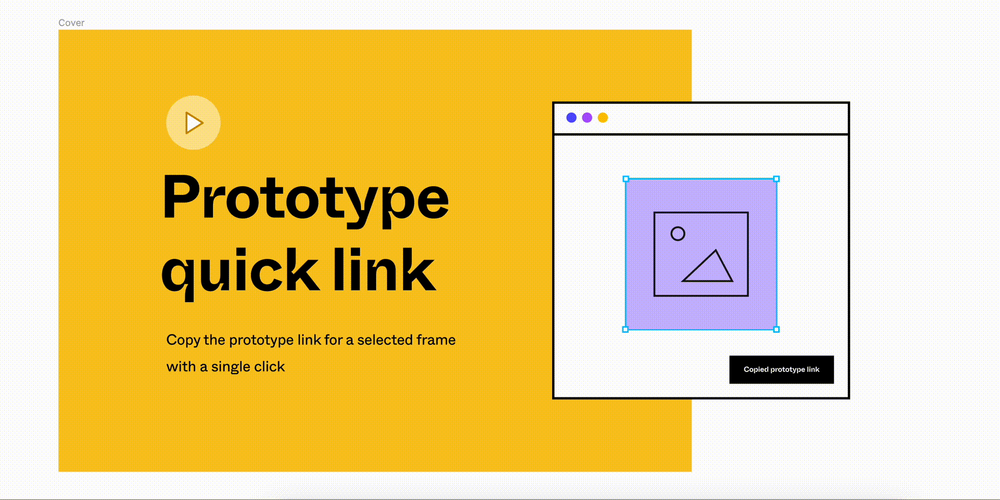

### [UNDER DEVELOPMENT]
# Copy Prototype Link &mdash; Figma Plugin

This is a [Figma](figma.com) plugin that provides an easy way to
copy to the clipboard the [Prototype link](https://help.figma.com/hc/en-us/articles/360039822654-Share-your-Prototype-with-Others)
to a specific frame without having to switch into the [Presentation mode](https://help.figma.com/hc/en-us/articles/360040318013-View-Prototypes-with-Presentation-View).


## How To Use

`// TODO: add the instructions`


### Demo

`// TODO: add the demo`

[<br>](img/demo.gif)


## Development

#### Installation
```
npm run install
```

#### Watch

Run the watcher that will transpile .ts files into .js files on change
```
npm run watch
```

#### Build

Build for production
```
npm run build
```

#### Bump the app version

```
npm run bump
# or
npm run patch
```

## TODO
- Add [setRelaunchData](https://www.figma.com/plugin-docs/api/properties/nodes-setrelaunchdata/)


## Contributing
Pull requests are welcome. For major changes, please open an issue first to discuss what you would like to change.


## Credits
The idea initiator - [Filippos Protogeridis](https://github.com/protogeridis)


## License
[MIT](LICENSE)