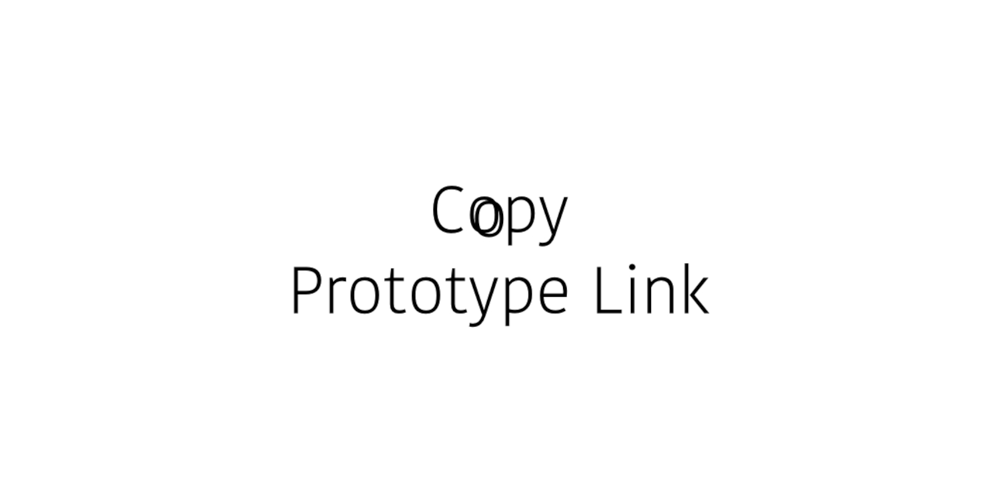

# Copy Prototype Link &mdash; Figma Plugin

This is a [Figma](figma.com) plugin that provides an easy way to
copy to the clipboard the [Prototype link](https://help.figma.com/hc/en-us/articles/360039822654-Share-your-Prototype-with-Others)
to specific *Frames* without having to switch into the [Presentation mode](https://help.figma.com/hc/en-us/articles/360040318013-View-Prototypes-with-Presentation-View).


## How To Use

Select layers and run the command `Copy Prototype Link` and the link will
be copied to the clipboard. When you first start the plugin in a File
you will need to set the **File Key** on the Settings window manually.
Just copy the whole **File URL** from the browser's address bar and
paste it to the input field and the plugin will extract
the **File Key** automatically. You also can paste only
the **File Key** to the input field.

The **File Key** looks like:
> ht<span>tps://figma.com/file/**e9z7p5lisUPmRe9z7p5lisUPm**/FileName

It is also possible to select and copy links to multiple selected *Frames*.
In this case each link will be started with it's *Frame* name.

Your file share link is saved in your File safely. It’s not sent to any external server.


### Demo

`// TODO: add the demo`

[<br>](img/demo.gif)


## Development

#### Installation

1. Install dependencies

    ```sh
    npm run install
    ```

2. Get the [Figma desktop app](https://www.figma.com/downloads/). At this time, plugin development and testing needs to be done using the Figma desktop app. This is because Figma needs to read your code saved as a local file.

3. Log in to your account and open the file editor in the Figma desktop app.

4. Go to `Menu > Plugins > Development > New Plugin...`. This will bring up the "Create a plugin" modal. Choose the `manifest.json` from this project.


#### Watch

Run the watcher that will transpile .ts files into .js files on change
```sh
npm run watch
```


## Publishing

1. Build for production

    ```sh
    npm run build
    ```

2. Bump the app version

    ```sh
    npm run bump
    ```

3. Follow to the official guide [Publish plugins to the Figma Community](https://help.figma.com/hc/en-us/articles/360042293394-Publish-plugins-to-the-Figma-Community#Submit_your_plugin)


## TODO
- Add a function to get the File Key automatically without need to insert it
manually. Currently this is not possible, but I hope this feature will be added
to the Figma API soon.
- Fix the blinking while Copy Prototype Link command when the fileId does exist.
The problem is the UI should be displayed to be able to render an input and
copy value to clipboard. So currently the window (UI) shows up for a second.
There is no way to copy value without showing the input. Perhaps Figma will
add an ability to move the window and we will be able to move it out of the
viewport's edge.
- Add [setRelaunchData](https://www.figma.com/plugin-docs/api/properties/nodes-setrelaunchdata/)
- On Figma, you can set a frame as a Starting Frame for a
prototype. When you do, by default when you go into prototype mode
it starts from there. If the starting frame has been set, then
Copy Prototype Link points to that frame, which isn't intended.
We should find a way to bypass this behavior.


## Contributing
Pull requests are welcome. For major changes, please open an issue first to discuss what you would like to change.


## Credits
The idea initiator & artwork - [Filippos Protogeridis](https://github.com/protogeridis)


## License
[MIT](LICENSE)